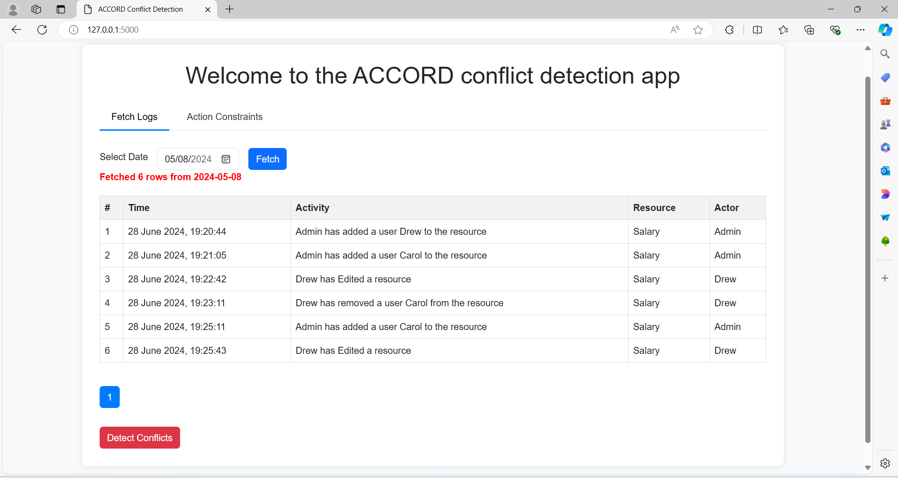
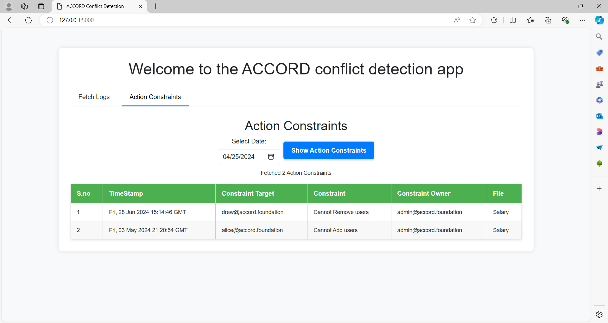

# ACCORD Conflict Detection

ACCORD Conflict Detection is a Flask-based web application designed to manage and detect conflicts in Google Drive activity logs. The application extracts activity logs, defines fine-grained action constraints on shared resources, and uses a conflict detection algorithm to identify and resolve conflicts.

## Installation

1. **Install Google Client Library for Access Activity Logs via Reports API:**
   ```bash
   pip install --upgrade google-api-python-client google-auth-httplib2 google-auth-oauthlib
2. **Install Flask and related librarires:**
   ```bash
   pip install Flask
   pip install Flask-WTF Flask-SQLAlchemy Flask-Migrate

## Configuration
1. **Database Setup (MySQL Workbench locally):** Database dump can be provided on request.
2. **API access tokens for reports API in token.json and tokens directory contains drive api tokens**: json files and access tokens can be provided to authroized personnel on request.

## Application routes (app.py)
1. **/ (index):** Renders the main page (index.html) and initializes the Google Drive Reports API service for the admin user
2. **/refresh_logs (POST):** Updates the local database with the latest Google Drive activity logs retrieved using the Reports API.
3. **/detect_conflicts_demo (POST):** Handles the demonstration of conflict detection. Retrieves logs and action constraints from the database, runs the detection algorithm (detectmain), and returns detected conflicts with detection time metrics.
4. **/addActionConstraints (POST):** Receives JSON data containing user-defined action constraints, processes them, and adds them to the database (log_details) for future conflict detection.
5. **/fetch_actionConstraints (POST):** Retrieves action constraints from the database based on a specified date, processes them into a structured format, and returns them as JSON for display.
6. **/fetch_drive_log (GET):** Retrieves Google Drive activity logs from the Reports API based on a specified start time (startTime) and updates the local log database (log_details).
7. **/get_action_constraints (POST):** Retrieves specific action constraints from the database (log_details) based on document ID, action type, and constraint target, and returns them as JSON.

## index.html
1. **Fetch Logs Tab:** Allows users to select a date and fetch activity logs from a specified date. It includes a table to display fetched logs, a loader for indicating data fetching, and a button to detect conflicts based on the fetched logs.

2. **Action Constrains Tab:** Enables users to view and manage action constraints associated with logged activities. It includes a form to select a date, a button to display action constraints for that date, and a table to show detailed constraints including timestamps, target resources, and owners.


## Conflict Detection Algorithm: Detection Time Calculation
1. Extarct activity logs from database.
2. Extract all action constraints from database.
3. T0 -> Start Time
4. Call detection Engine to compare activity logs against action constraints to detect conflicts. (Activity Handler and Action constraint Handler)
5. Identify conflicts and store them.
6. T1 -> Stop Timer
7. T1-T0 = Detection Time

## Running the Application
1. After installing all the packages, configuring the database and setting up access tokens, exuecute following command to run app:
```bash
python app.py
2. Open a web browser and goto:
```bash
http://127.0.0.1:5000

This README.md provides an overview of the ACCORD Conflict Detection project, installation and configuration instructions, descriptions of application routes, details about the index page menu tabs, and an explanation of how detection time is calculated.
